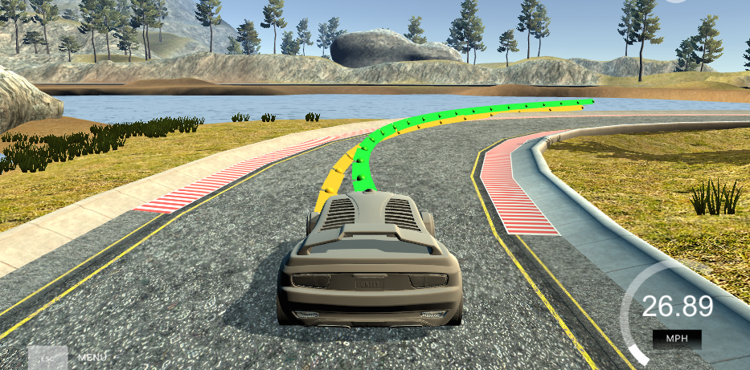

# CarND-Controls-MPC
Self-Driving Car Engineer Nanodegree Program

# Code Notes

I had a lot of difficulty getting the libraries to function on my laptop, which is a MBP running Yosemite 10.10.5.  There were some very serious issues with Ipopt, partially documented here, and there were very bad interactions with the Yosemite installed Clang.  So `Cmakelist.txt` is somewhat customized.  I found that a friend was able to run the code error free by using the original `Cmakelist.txt` file from the Udacity repo on a machine running Ubuntu, so if there's a problem compiling, try that.  That said, I did try to restore the file to a format where it will compile on Ubuntu.

# Implementation

For the model, I followed the basic direction suggested by Udacity.  Once it was up and running, I spent a lot of time tuning the cost function to get the MPC to do what I wanted: drive smoothly and fast without leaving the track.  I made some modifications including changing the exponents of the weights, and adding a new cost element.

## The Model

The model follows the basic motion model articulated in the course.  The six state elements - `x`, `y`, `psi`, `v`, `cte`, and `epsi` (the `psi` error) are modeled, including the effects of the steering actuator (`delta`) and the accelerator actuator (`a`).

This model is given over the solver with two sets of constraints and a cost function:

- Constraints describing how the motion model leads from one timestep to the next.  I made no changes to this from the standard Udacity model.
- Constraints describing the upper and lower bounds, or tolerance, for variation.  For the state elements, these are set to `0`, whereas for the actuators, they are set to the range of the actuators.
  + In this case, I kept the range for steering at `+/- 25 degrees`.
  + However, I did change the range of the accelerator, from the standard `[-1, 1]` to `[-0.5, 0.3]`.  I found that allowing the acceleration to go higher than 0.3 contributed to a tendency for the vehicle to leave the track in curves.  I also found that allowing the vehicle to brake harder than it accelerated helped keep it on the track in the curves.
- A cost function taking in various elements.  I modified the cost function in the following ways from typical:
  + For each cost element I added a coefficient, so I could weight them according to their importance.  Tuning these weights was critical to getting the vehicle to drive the track.  Since some variables were generally in the range `[-0.1, 0.1]` and others were generally in the range `[-1, 1]`, applying exponents to these could lead to very different values.
  + To tune these, I made an educated guess at values that would balance the elements, and then tuned them via adhoc twiddling.
  + I found that the most important term by far was `epsi` component of the cost function.  If you can get the vehicle to adopt the direction of the fitted polynomial, this tends to lead to a smooth line.
  + For the error terms coming from `cte`, `epsi`, and change in `delta`, I raised the terms to the 4th power.  I found that, because `f(x) = x^4` is a forms a broad, flatish valley near zero, but has steep sides, applying this exponent to these terms had the effect of giving the solver latitude in setting these values, so long as they were within a certain range of zero.  In a sense, moreso than with 2nd powers, it allowed the solver to "choose a racing line" that was not dead center.
  + I also added the `D`-factor from the PID controller: the square of the change in CTE.  This factor helped to dampen oscillations that built up.

## Timestep length and duration'

I stuck with the suggested duration of 0.1 seconds, in part because it seemed to work fine, and in part because changing it seemed to have implications for solving for latency.

I did play with `N`, however, and found that 20 worked nicely.  I started with `N = 10`, and I found that, as I was searching out suitable values for the cost function, the model tended to perform better as I had it look further ahead.  To get from 10 to 20, I went in steps as my models performed better at low speeds.  Looking 20 steps ahead was a nice balance of looking far enough ahead that the model would not make short term optimizations that were problematic, but also the compute time was reasonable.

## Polynomial fitting and MPC Preprocessing

I took the approach of transforming the waypoints into the vehicle's frame of referenced, and then doing all calculations within that frame of reference.  This was suggested by the Udacity template and indeed seemed to be easier.  I used a 3rd degrees polynomial as I had difficulty with a 4th degree polynomial.

### Poly fit issues

I found that, once I had the vehicle going around the track, the biggest problem was it jumping off the curves *when the polynomial jumped around near the curves.*  It seems to be the case that there were not really enough waypoints for the polynomial to fit through the curves, and so when a new waypoint was added or dropped, the polynomial would shift suddenly near to the edge of the curve, and this could cause the vehicle to try to adopt a new line.  In so doing, it would often go off the track.  Here's an example image where the polyfit, the yellow line, can potentially send the vehicle off track:

My solution was to set conservative MPC parameters that would slow the vehicle down in sections of track where this was a problem.  However, for a real life situation like this, I don't think the MPC is really the problem.  I think the sparsity of the way points and the fitting procedure are more problematic, and I would approach those differently given time.

## Latency

I took the standard approach to latency.  By adopting `dt = 0.1`, I simply took the actuator settings from the 2nd timestep of the solution (timestep 1 in the indexing, and the first timestep to have actuators settings), and added those as instructions for the simulator.  Since the thread then sleeps for 0.1 seconds, this works out approximately correctly.

I think there are improvements to be made here, mainly by tracking what actuator commands are in the pipeline, and modeling the impact of those forward in the MPC process.  However, for this project, the above approach was sufficient.
